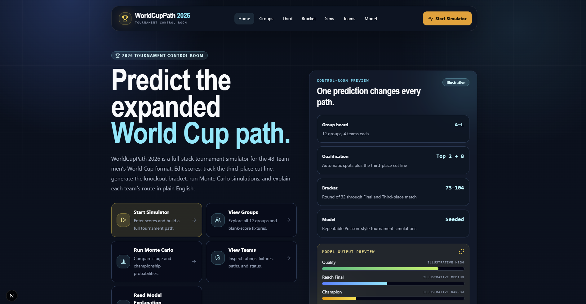
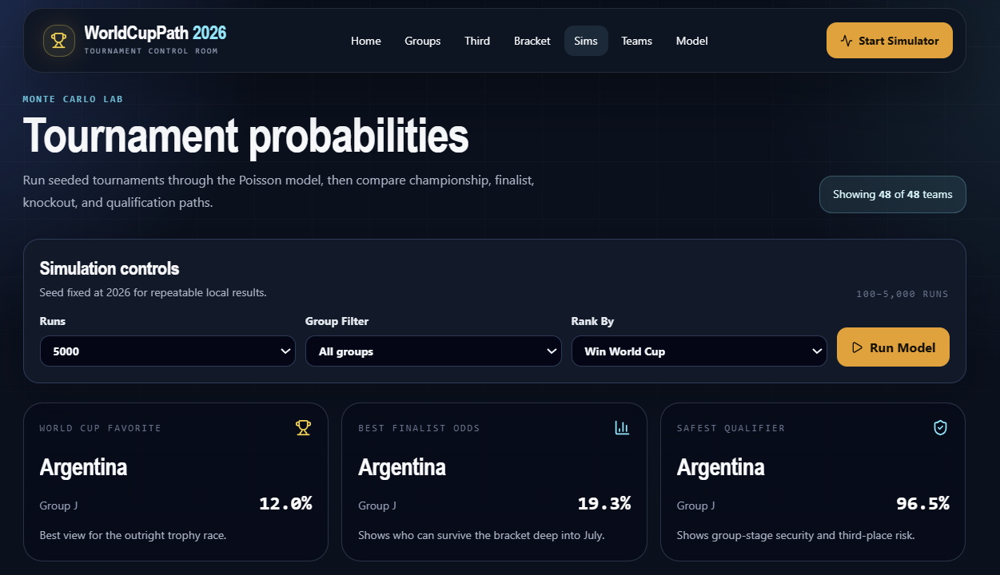
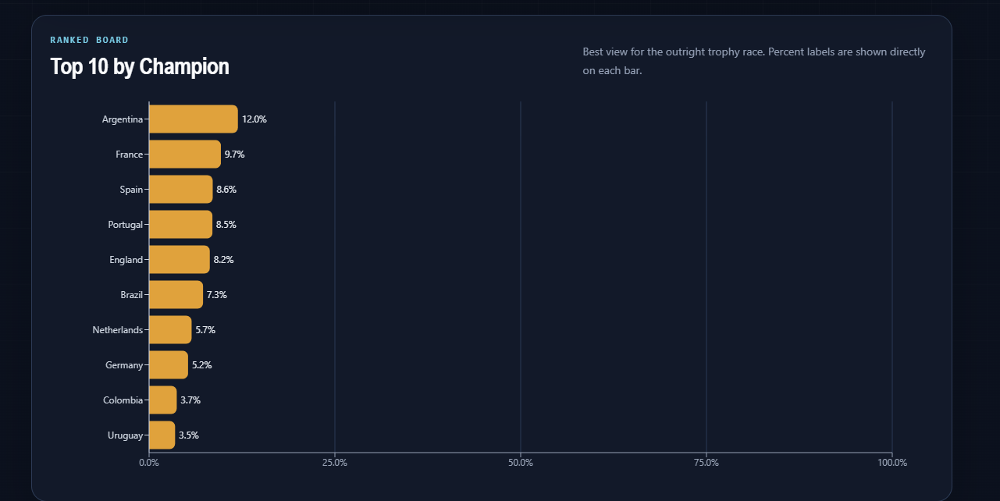
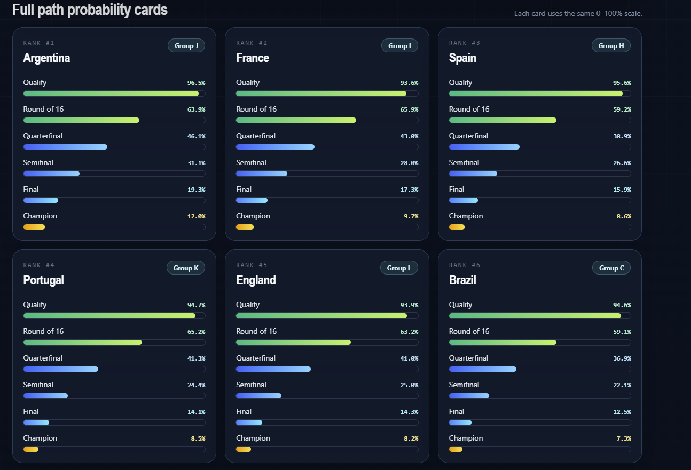
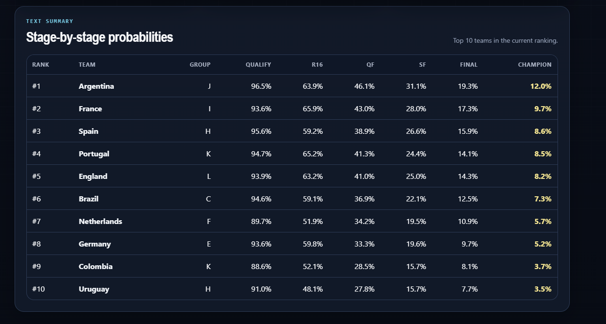

# WorldCupPath 2026

**A full-stack 2026 FIFA Men's World Cup prediction simulator for group scenarios, third-place qualification, knockout paths, Monte Carlo probabilities, and plain-English team explanations.**

WorldCupPath 2026 is a portfolio-ready tournament analytics app built around the expanded 48-team World Cup format. Users can edit group-stage scores, watch standings update, rank the 12 third-place teams, generate the Round of 32 bracket, choose knockout winners, save/share predictions, and run seeded simulations to estimate each team's path to the trophy.

> **Disclaimer:** This is an unofficial fan-made educational project. It is not affiliated with, endorsed by, or sponsored by FIFA. Ratings are illustrative model inputs, not official FIFA ratings, betting advice, or tournament forecasts.

## Screenshots

Current screenshots cover the landing page and Monte Carlo simulation dashboard. Simulator score-entry, third-place, bracket, and GIF assets remain as final media TODOs.

| Landing page | Monte Carlo controls | Monte Carlo chart |
| --- | --- | --- |
|  |  |  |

| Probability cards | Probability table | Knockout bracket |
| --- | --- | --- |
|  |  | TODO: `docs/screenshots/bracket.png` |

Recommended final media checklist:

- [x] Landing page desktop screenshot
- [ ] Simulator score-entry screenshot
- [ ] Third-place qualification screenshot
- [ ] Bracket/champion screenshot
- [x] Monte Carlo probability screenshot
- [ ] Short GIF showing score entry -> standings -> bracket

## Features

- **2026 format support:** 48 teams, 12 groups, 72 group matches, 32-team knockout stage.
- **Editable group predictions:** Enter scorelines and preview API-authoritative standings.
- **Standings engine:** Calculates points, wins, draws, losses, goals for/against, goal difference, and points.
- **Third-place qualification:** Ranks all 12 third-place teams and marks the top 8 as qualified.
- **Round of 32 bracket:** Generates knockout matches 73-104, including Final and Third-place match support.
- **Manual knockout picks:** Pick winners once all group-stage scores are complete.
- **Monte Carlo simulation:** Run seeded simulations and compare qualification, stage reach, finalist, and champion probabilities.
- **Team pages:** Browse teams, ratings, fixtures, baseline model indicators, and deterministic path explanations.
- **Save/share predictions:** Store immutable prediction snapshots in SQLite and remix them later.
- **Plain-English explanations:** Deterministic explanation engine describes team paths without calling an LLM.
- **Responsive dashboard UI:** Dark sports-broadcast interface with mobile navigation, accessible states, and chart/table summaries.

## Tech stack

| Layer | Tools |
| --- | --- |
| Frontend | Next.js 16, React 19, TypeScript, Tailwind CSS 4 |
| Frontend state/UI | Zustand, Recharts, Lucide React |
| Backend API | FastAPI, Pydantic, SQLAlchemy |
| Simulation engine | Python 3.12, NumPy, editable local package in `packages/simulator` |
| Database | SQLite for local development |
| Tests/checks | pytest, Ruff, Vitest, Testing Library, ESLint, TypeScript |
| Local orchestration | Native dev commands, Windows start/stop scripts, Docker Compose |

## Architecture overview

```txt
worldcup-path-2026/
├── apps/
│   ├── web/                  # Next.js App Router frontend
│   └── api/                  # FastAPI backend and SQLite persistence
├── packages/
│   ├── data/                 # snapshots, teams, fixtures, ratings, bracket allocation artifact
│   └── simulator/            # Python tournament engine and Monte Carlo logic
├── docs/                     # architecture, model, tournament rules, API reference
├── AGENTS.md                 # Codex/project instructions
├── DESIGN.md                 # frontend design system
├── docker-compose.yml
└── README.md
```

Runtime flow:

```txt
Next.js UI
  -> FastAPI REST API
    -> Python simulator package
      -> JSON seed data + SQLite prediction snapshots
```

The frontend keeps score-entry state locally with Zustand, then asks the API to calculate tournament previews. The API delegates tournament logic to the simulator package so standings, third-place ranking, bracket generation, simulations, and explanations are kept in one testable Python layer.

## 2026 World Cup format support

WorldCupPath models the expanded 2026 men's World Cup structure:

- 48 teams
- 12 groups of 4
- 3 group matches per team
- Top 2 teams from each group qualify automatically
- 8 best third-place teams qualify
- Knockout stage starts at the Round of 32
- Bracket includes Round of 32, Round of 16, Quarterfinals, Semifinals, Third-place match, Final, and Champion

The project includes a versioned and checksummed Round-of-32 third-place allocation artifact for the 495 qualifying-group combinations.

Known simplification: group ranking implements a practical first-release tiebreak order: points, goal difference, goals scored, wins, seed rating/team fallback. Full FIFA fair-play and drawing-of-lots handling is documented as future work.

See [docs/tournament-rules.md](docs/tournament-rules.md).

## Simulator and model explanation

The model is intentionally simple, transparent, and explainable:

1. Each team starts with seed data:
   - Elo rating
   - attack rating
   - defense rating
2. Matchups are converted into expected goals.
3. Scores are sampled with a Poisson-style simulation.
4. Knockout draws are resolved with a seeded, rating-weighted penalty decision.
5. Monte Carlo mode repeats full tournaments and reports empirical probabilities.

Returned probabilities include:

- Win group
- Qualify for Round of 32
- Reach Round of 16
- Reach Quarterfinals
- Reach Semifinals
- Reach Final
- Win World Cup

The explanation engine is deterministic. It reads structured tournament state and produces plain-English path summaries without using an external LLM.

See [docs/model-explanation.md](docs/model-explanation.md).

## Data snapshot

The default dataset is `official-pre-tournament`, with blank scores by design.

- Snapshot date: **as of 2026-06-20**
- Manifest: [packages/data/manifest.json](packages/data/manifest.json)
- Teams/groups source: [FIFA standings](https://www.fifa.com/en/tournaments/mens/worldcup/canadamexicousa2026/standings)
- Fixtures source: [FIFA scores and fixtures](https://www.fifa.com/en/tournaments/mens/worldcup/canadamexicousa2026/scores-fixtures)
- Regulations source: [FIFA World Cup 2026 regulations PDF](https://digitalhub.fifa.com/m/636f5c9c6f29771f/original/FWC2026_regulations_EN.pdf)

`sample-demo` is included for demonstration. `live-snapshot` is reserved structurally, but live-data ingestion is intentionally out of scope for this version.

## How to run locally

### Prerequisites

- Node.js 22+
- Python 3.12+
- Git

### Option 1: one-click Windows launch

From the project folder, double-click:

- `Start WorldCupPath 2026.cmd`

This starts the FastAPI backend and Next.js frontend locally, then opens:

```txt
http://127.0.0.1:3000
```

To stop both services, double-click:

- `Stop WorldCupPath 2026.cmd`

PowerShell alternative:

```powershell
.\scripts\start-local.ps1
```

Without opening a browser:

```powershell
.\scripts\start-local.ps1 -NoBrowser
```

### Option 2: manual backend and frontend

Start the backend in one terminal:

```bash
cd apps/api
python -m venv .venv
```

Activate the virtual environment:

```bash
# macOS/Linux
source .venv/bin/activate

# Windows PowerShell
.venv\Scripts\Activate.ps1
```

Install and run:

```bash
pip install -r requirements-dev.txt
uvicorn app.main:app --reload
```

The API runs at:

```txt
http://127.0.0.1:8000
```

Interactive API docs:

```txt
http://127.0.0.1:8000/docs
```

Start the frontend in another terminal:

```bash
cd apps/web
npm install
npm run dev
```

Open:

```txt
http://127.0.0.1:3000
```

### Option 3: Docker Compose

```bash
docker compose up --build
```

Services:

- Web: `http://localhost:3000`
- API: `http://localhost:8000`

## Frontend commands

Run from `apps/web`:

```bash
npm install
npm run dev
npm run lint
npm run typecheck
npm run test
npm run build
```

## Backend commands

Run from `apps/api` with the virtual environment activated:

```bash
pip install -r requirements-dev.txt
uvicorn app.main:app --reload
```

Run backend checks from the repository root:

```bash
ruff check apps/api packages/simulator
pytest -q
```

## API overview

Core endpoints:

- `GET /api/health`
- `GET /api/snapshots`
- `GET /api/teams`
- `GET /api/teams/{team_id}`
- `GET /api/groups`
- `GET /api/groups/{group_id}`
- `GET /api/fixtures`
- `POST /api/tournament/preview`
- `POST /api/predictions`
- `GET /api/predictions/{prediction_id}`
- `POST /api/simulate/match`
- `POST /api/simulate/tournament`
- `GET /api/simulations/monte-carlo?runs=1000&seed=2026`
- `GET /api/teams/{team_id}/explanation`

See [docs/api-reference.md](docs/api-reference.md).

## Documentation

- [Architecture](docs/architecture.md)
- [Model explanation](docs/model-explanation.md)
- [Tournament rules](docs/tournament-rules.md)
- [API reference](docs/api-reference.md)
- [Design system](DESIGN.md)
- [Codex/project instructions](AGENTS.md)

## Future improvements

- Add remaining simulator score-entry, third-place, bracket screenshots, and a short demo GIF.
- Complete the full FIFA head-to-head, fair-play, and drawing-of-lots tiebreak chain.
- Add richer team pages with possible knockout opponents from saved prediction state.
- Replace illustrative ratings with a documented, updateable rating pipeline.
- Add optional live snapshot ingestion behind a data adapter.
- Add PostgreSQL/Alembic support for deployment-ready persistence.
- Add deeper browser smoke tests for the full simulator flow.
- Add venue, travel, injury, lineup, and recent-form model factors.

## Author

Built by **anshc2394-beep**.

- GitHub: `https://github.com/<your-github-username>`
- LinkedIn: `https://www.linkedin.com/in/<your-linkedin-slug>/`
- Portfolio: `https://<your-portfolio-url>`

Replace the placeholders above before publishing the repository.
