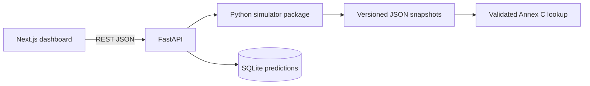

# Architecture

The simulator package is framework-independent. FastAPI owns validation, HTTP errors, and persistence. Next.js owns presentation and an editable Zustand session, while all derived tournament state comes from `POST /api/tournament/preview`.

Prediction rows store both user inputs and the derived state so immutable shared links remain stable across later engine changes. SQLAlchemy isolates database access and accepts a PostgreSQL URL without changing tournament logic.

The Annex C artifact is validated on API startup. Invalid schema, checksum, combination count, slot names, duplicates, or omissions raise `BracketAllocationError` and produce a structured `503` without disabling catalog pages.

